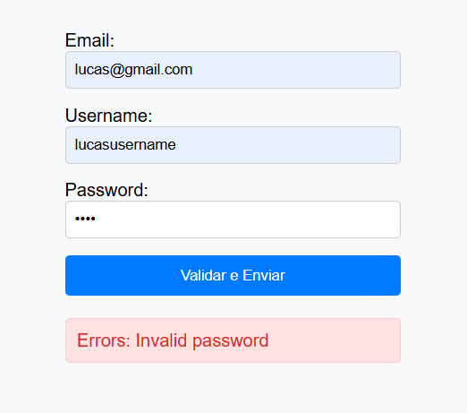

# JavaScript Form Validator

Form validator made with JavaScript and HTML. The form has the followgin rules: 
 - Password must contains 5 (five) capital letters, 6 (six) symbols and 2 (two) hyphens in any order.
 - Uesrname must not contains white spaces.
 - Email must be a gmail (@gmail.com).

---

  
  
  

